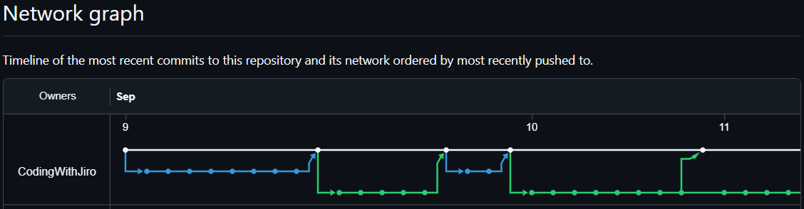
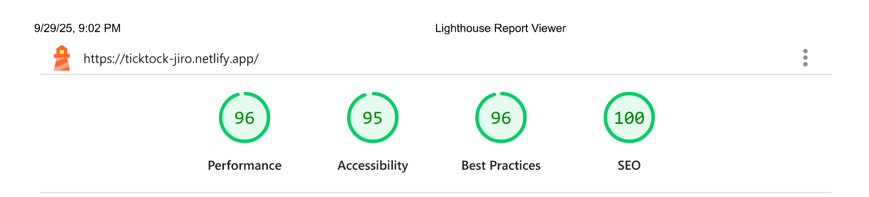

# 💻 TickTock

## ℹ️ TickTock: Search A Location, Get Their Date and Time

| _Mobile Preview (375x812)_                                   | _Desktop Preview (1440x960)_                                    |
| ------------------------------------------------------------ | --------------------------------------------------------------- |
|       |       |
|  |  |

TickTock is a responsive clock web app where users can search for any location and instantly see its current local date and time. It showcases live clock movement with an analog interface.

This project is inspired from Wes Bos' free [#JavaScript30 Course](https://javascript30.com/)

---

## 🔍 Overview

This project combines real-time APIs with JavaScript modules to deliver dynamic time data based on user input.

It also implements a playful easter egg mode to surprise users especially Marvel fans.

---

## ✨ Features

- Search any city and instantly fetch its local date and time
- Animated analog clock hands synced to the local time
- Fully responsive mobile-first layout
- Semantic HTML + ARIA for better accessibility
- Dynamic content updates
- Hidden easter egg with surprise animation on secret button click
- Fetches data from IP API and TimeZone DB API
- Lighthouse evaluated for performance and accessibility

---

## 🔀 Development Workflow

> Click to view the full branch and merge history

This project adapts a [granular branching and commit workflow](https://github.com/CodingWithJiro/wesbos-js-30-clock/network) to simulate team collaboration. Each feature, fix, documentation, and chore is tracked in its own branch with descriptive commits.

Each [pull request](https://github.com/CodingWithJiro/wesbos-js-30-clock/pulls?q=is%3Apr+is%3Aclosed) I created contains a clear description, change list, screenshots for UI updates, and reviewer notes.

_This ensures I maintain a professional workflow, even as a solo developer._

---

## 🧠 What I Learned

- Using `fetch` to integrate multiple third-party APIs
- Importing a third-party function from [date-fns-tz CDN](https://esm.sh/date-fns-tz)
- Adding ARIA roles for dynamic content and accessibility
- Handling user input, events, and hidden features for engagement
- Practicing a professional branching + PR workflow on GitHub
- Gained hands on experienced with local dates as well as dates with timezone parameters

---

## 🛠️ Tech Used

- HTML5
- CSS3
- JavaScript
- Git
- GitHub
- Netlify

---

## 🎨 Design Reference & Tools

- JPG design image
- Figma

---

## 🚀 How to Run

1. Clone the repository
2. Open `index.html` in your browser

---

## 🌐 Live Demo

Or you can check out the 👉 [live website here](https://ticktock-jiro.netlify.app/)

---

## 📊 Performance Report

A **Google Lighthouse** audit was conducted on the final version of this project. You can view the full report [here](./assets/downloads/lighthouse-performance-report.pdf).

---

## 🧑‍💻 Author

Created by **Elmar Chavez**

🗓️ Month/Year: **September 2025**

📚 Journey: **6th** month of learning _frontend web development_.

<!--

WES BOS JAVASCRIPT30 TAGS:
html css javascript vscode git github netlify 6th-month wes-bos javascript30 project lighthouse theme-toggle figma

MERGE PULL REQUEST COMMENT SIMULATING PR APPROVAL FROM A TEAM:
In a team setting, this PR would await senior developer approval.
For this solo project, I’ll proceed with merging after review.

-->
